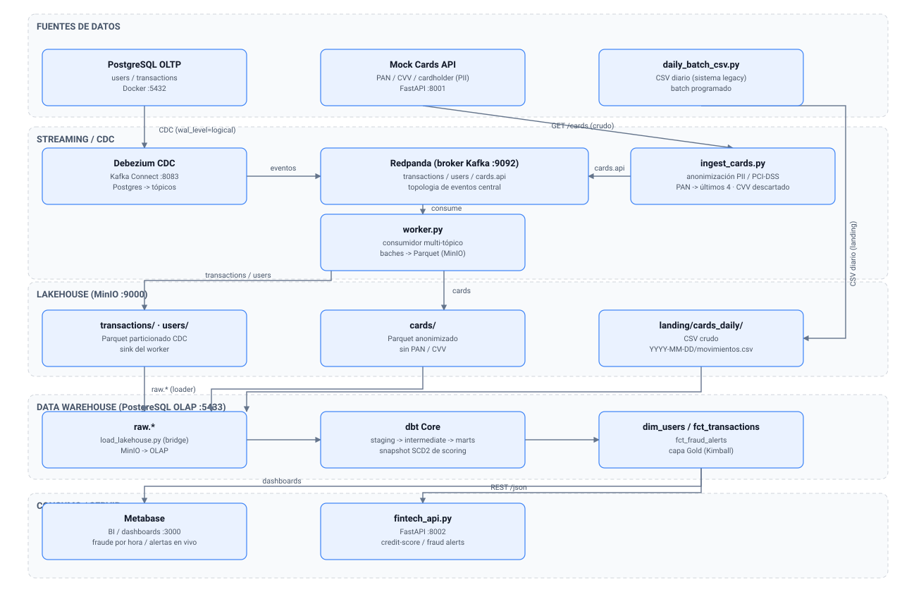

# Pipeline de Detección de Fraude y Scoring de Crédito

Pipeline de datos con streaming, CDC (Change Data Capture), lakehouse y
transformaciones analíticas para detectar fraude en tiempo real y mantener un
scoring crediticio actualizado.

- **Data Engineering**: ingesta en tiempo real con streaming + CDC, landing de
  batch, y anonimización de datos sensibles (PII / PCI-DSS).
- **Analytics Engineering**: transformaciones en capas Bronze / Silver / Gold con
  dbt sobre el Data Warehouse.

Estructura interna del proyecto (fases y detalle) en
[`roadmap_proyecto_fintech.txt`](roadmap_proyecto_fintech.txt).

---

## Para qué sirve

El proyecto emula un sistema de detección de fraude y evaluación de crédito en
fintech, con tres usos principales:

1. **Detección de fraude en tiempo real**
   - Simulador de transacciones (`scripts/generator.py`) que inserta operaciones
     normales y con patrones de fraude simulados (múltiples montos altos en poco
     tiempo, ubicaciones lejanas, etc.).
   - Cada cambio en la tabla de transacciones se captura por CDC (Debezium) y
     viaja por streaming a un broker y de ahí a un lakehouse como Parquet.
   - Base de datos OLAP lista para alertas agregadas de fraude.

2. **Ingesta realista de datos de tarjetas (PII)**
   - Una **Mock API** (puerto 8001) simula una fuente externa de tarjetas con
     datos **sensibles** (PAN, CVV, cardholder).
   - Un **ingestor** aplica masking obligatorio (PCI-DSS): conserva solo los
     últimos 4 dígitos del PAN, descarta el CVV y enmascara el titular.
   - El dato anonimizado cae como Parquet al lakehouse; el dato crudo **nunca**
     se persiste.
   - Un proceso batch diario simula un sistema legado que deja un CSV en la
     landing zone de MinIO.
   - Detalle completo en el anexo de la Fase 3 del
     [`roadmap_proyecto_fintech.txt`](roadmap_proyecto_fintech.txt).

3. **Scoring y data warehouse**
   - Base OLTP con usuarios (scoring 300–850, límite, riesgo) y transacciones.
   - Base OLAP pensada para que dbt construya dimensiones, hechos y alertas.

---

## Stack tecnológico

| Componente                        | Tecnología                                   | Puerto |
|-----------------------------------|---------------------------------------------|--------|
| Base OLTP (fuente)                | PostgreSQL 15                               | 5432   |
| Broker de streaming               | Redpanda (compatible Kafka)                 | 9092 / 9644 / 8081 |
| Consola de tópicos                | Redpanda Console                            | 8080 |
| CDC / Kafka Connect               | Debezium                                    | 8083 |
| Lakehouse (S3 compatible)         | MinIO                                       | 9000 / 9001 |
| Data Warehouse analítico          | PostgreSQL (OLAP) (dbt / Metabase)          | 5433 |
| BI / Dashboards                   | Metabase                                    | 3000 |
| Mock API de tarjetas (PII)        | FastAPI / uvicorn (local)                   | 8001 |

---

## Arquitectura (resumen)



_Fuente editable del diagrama en
[`docs/diagrama_arquitectura.mmd`](docs/diagrama_arquitectura.mmd)._

Detalle en texto plano de los flujos:

```
   FLUJO 1 - TRANSACCIONES (streaming / CDC)
   ~~~~~~~~~~~~~~~~~~~~~~~~~~~~~~~~~~~~~~~~~
                               +------- CDC (Debezium) --------+
   Simulador (OLTP) ---------->| postgres_oltp.public.transactions |--> Redpanda
   Postgres (Docker, 5432)     +-------------------------------+     tópico
                                  postgres_oltp.public.transactions / .users
                                          |
                                          v
                                Worker (scripts/worker.py)
                                          |
                                          v
                                MinIO lakehouse  (bucket fintech-lakehouse)
                                /transactions/  (Parquet CDC particionado)

   FLUJO 2 - TARJETAS / PII (streaming con anonimización)
   ~~~~~~~~~~~~~~~~~~~~~~~~~~~~~~~~~~~~~~~~~~~~~~~~
                                       Mock Cards API (FastAPI, 8001)
                                       GET /cards -> PAN/CVV/cardholder (crudo)
                                          |
                                          v
                               Ingestor (scripts/ingest_cards.py)
                               masking PII: PAN->últ.4, CVV DESCARTADO, titular***
                                          |
                                          v
                               Redpanda tópico  cards.api --> Worker (worker.py)
                                          |
                                          v
                               MinIO lakehouse  /cards/  (Parquet anonimizado, SIN PAN/CVV)

   FLUJO 3 - BATCH DIARIO (CSV legacy)
   ~~~~~~~~~~~~~~~~~~~~~~~~~~~~~~~~~~~~~~~~~~~~~~~~~
   daily_batch_csv.py (scripts/daily_batch_csv.py)  
   ----------> MinIO lakehouse  /landing/cards_daily/YYYY-MM-DD/movimientos.csv

   TODOS LOS FLUJOS CONVERGEN (Fase 3 principal)
   ~~~~~~~~~~~~~~~~~~~~~~~~~~~~~~~~~~~~~~~~~~~~~~~~~
       MinIO lakehouse
          |
          v  scripts/load_lakehouse.py   (bridge lakehouse -> DW)
          v
   PostgreSQL OLAP (5433)  tablas raw.*
          |
          v  dbt (Fase 3): staging -> intermediate -> marts
   dim_users / fct_transactions / fct_fraud_alerts
          |
          v
   Metabase (3000)  -> data source "Data Warehouse (OLAP)"
```

---

## Cómo bajarlo y levantarlo

### Requisitos
- Docker + Docker Compose
- Python 3.10+ (para los scripts que corren en el venv)
- WSL / Linux (los scripts asumen rutas y `venv/`)

### 1. Clonar
```bash
git clone <url-del-repo>
cd fraude_scoring/python
```

### 2. Configurar variables de entorno
```bash
cp .env.example .env
```
Editar `.env` si se quieren cambiar usuarios/puertos. **Nunca commitear `.env`**
(ya está en `.gitignore`).

### 3. Levantar la infraestructura
```bash
docker compose up -d
```
Esto levanta: `postgres_oltp`, `postgres_olap`, `redpanda`, `redpanda-console`,
`debezium`, `minio`, `minio-init`, y `metabase`.

Comprobar estado:
```bash
docker compose ps
```

### 4. Preparar el entorno Python (venv) para los scripts
```bash
python -m venv venv
./venv/bin/pip install -r scripts/requirements.txt
```

### 5. Inicializar el conector de CDC (Debezium)
El conector se publica vía REST API de Kafka Connect:
```bash
curl -s -H "Content-Type: application/json" -X POST \
  http://localhost:8083/connectors \
  -d @config/debezium/postgres-connector.json
```
Verificar:
```bash
curl -s http://localhost:8083/connectors   # -> ["fintech-postgres-oltp"]
```

### 6. Generar datos reales y movimiento
```bash
# Simular transacciones (OLTP)
./venv/bin/python scripts/generator.py --limit 150

# Generar para una fecha especifica (created_at fijo, util para backfill)
./venv/bin/python scripts/generator.py --limit 300 --date 2026-08-08

# Levantar el Mock API de tarjetas (PII) en segundo plano
./venv/bin/uvicorn api.mock_cards_api:app --host 0.0.0.0 --port 8001 &

# Ingestar tarjetas (anonimiza y publica a Redpanda)
./venv/bin/python scripts/ingest_cards.py --pages 2

# Batch diario -> landing CSV en MinIO
./venv/bin/python scripts/daily_batch_csv.py --rows 200
```

### 7. Correr el worker (escribe Parquet al lakehouse)
```bash
# Solo transacciones CDC
./venv/bin/python scripts/worker.py --topic transactions

# Solo tarjetas (cards.api)
./venv/bin/python scripts/worker.py --topic cards

# Todos los tópicos
./venv/bin/python scripts/worker.py
```

### 8. Verificar
- **Redpanda Console:** http://localhost:8080 (ver tópicos y eventos)
- **MinIO:** http://localhost:9001 (bucket `fintech-lakehouse`, carpetas
  `transactions/`, `cards/`, `landing/cards_daily/`)
- **Metabase:** http://localhost:3000
- **Mock API cards:** http://localhost:8001/cards?page=1&page_size=2
- **Debezium status:** http://localhost:8083/connectors

> Los micro-batches del worker se escriben cuando se acumulan (`BATCH_MAX`,
> default 200) o pasa el `BATCH_TIMEOUT_S` (5 s), configurable vía `.env`.

### 9. Fase 3 — dbt y Data Warehouse (Analytics Engineering)

**Flujo:** `MinIO (lakehouse)` -> `load_lakehouse.py` -> `PostgreSQL OLAP (raw.*)` -> `dbt` (staging/intermediate/marts) -> `Metabase`.

```bash
# 1) Preparar dbt (solo la primera vez)
./venv/bin/pip install dbt-postgres
cd dbt_fintech && ../venv/bin/dbt deps      # instala dbt-expectations

# 2) Bridge: copiar Parquet/CSV de MinIO a tablas raw.* en OLAP (5433)
cd .. && ./venv/bin/python scripts/load_lakehouse.py

# 3) Ejecutar transformaciones (perfil en dbt_fintech/)
cd dbt_fintech
DBT_PROFILES_DIR=$PWD ../venv/bin/dbt run
DBT_PROFILES_DIR=$PWD ../venv/bin/dbt snapshot     # SCD2 de scoring de usuarios
DBT_PROFILES_DIR=$PWD ../venv/bin/dbt test         # 26 tests de calidad

# 4) Ver en Metabase: Admin -> Databases -> "Data Warehouse (OLAP)"
#    (fuente ya conectada a fintech_olap; marts en public_marts.*)
```

**Capas del modelo:**
- **Bronze (staging):** `stg_transactions`, `stg_users`, `stg_cards`, `stg_card_movements` (dedup y tipado).
- **Silver (intermediate):** snapshot SCD2 `snap_users_scoring` (historial de scoring) +
  `int_user_transaction_velocity` (ventanas 5/15/60 min por usuario).
- **Gold (marts):** `dim_users`, `fct_transactions`, `fct_fraud_alerts`.
  Reglas de alerta: monto >= 5000, monto > límite de crédito, >= 5 tx en 5 min,
  ubicación distinta a la del usuario, o flag `is_flagged_fraud` de OLTP.

> El `profiles.yml` queda dentro de `dbt_fintech/`; se apunta con
> `DBT_PROFILES_DIR`. El loader `load_lakehouse.py` es el puente que el anexo
> de la Fase 3 dejaba pendiente (dbt-postgres no lee Parquet directo).

### 10. Fase 4 — API de scoring y fraud alerts

El backend `api/fintech_api.py` expone la capa Gold (`public_marts.*`) vía
FastAPI (uvicorn local, puerto 8002):

```bash
./venv/bin/uvicorn api.fintech_api:app --host 0.0.0.0 --port 8002

# Historial SCD2 del scoring de un usuario
curl http://localhost:8002/api/v1/users/3/credit-score
# Version vigente (404 si el usuario no existe)
curl http://localhost:8002/api/v1/users/3/credit-score/current
# Alertas de fraude activas (con las reglas desglosadas)
curl http://localhost:8002/api/v1/fraud/alerts?limit=50
# Solo de un usuario
curl "http://localhost:8002/api/v1/fraud/alerts?user_id=22&limit=10"
# Resumen de fraude por hora (ventana configurable, default 24h)
curl http://localhost:8002/api/v1/fraud/alerts/summary?hours=24
```

Swagger interactivo (OpenAPI) en `http://localhost:8002/docs`.

### 11. Dashboards en Metabase (Fase 4)

La fuente **Data Warehouse (OLAP)** ya está conectada a los esquemas
`public_marts` / `public_intermediate`. Guía + queries SQL listos para los
paneles de fraude por hora, distribución por scoring y alertas en vivo en
[`docs/metabase_dashboards.md`](docs/metabase_dashboards.md).

### 12. CI/CD (GitHub Actions)

El workflow `.github/workflows/ci.yml` corre en cada Pull Request:
`sqlfluff lint` (con templater dbt) y `dbt parse` (validación de sintaxis y
linaje sin conexión a la base, sin credenciales).

---

## Qué partes están hechas hasta ahora

### Fase 1 — Infraestructura y entorno (COMPLETA)
- [x] Estructura de carpetas
- [x] Docker Compose (OLTP + streaming)
- [x] Docker Compose (CDC, lakehouse y tooling)
- [x] Conectividad y healthchecks

### Fase 2 — Ingesta y streaming (COMPLETA)
- [x] Diseño de la base OLTP (tablas `users`, `transactions`)
- [x] Simulador de transacciones en tiempo real (`generator.py`)
- [x] Configuración Debezium CDC (tópico `postgres_oltp.public.transactions`)
- [x] Sink worker a Parquet particionado en MinIO (`worker.py`)
- **Validada E2E** en vivo (OLTP -> CDC -> Redpanda -> MinIO).

### Fase 3 — Data Warehouse y dbt (COMPLETA)
- [x] dbt-postgres inicializado (`dbt_fintech/`), perfil `fintech_lakehouse`
      apuntando a `postgres_olap` (5433).
- [x] `packages.yml` con `dbt_expectations` (instalado con `dbt deps`).
- [x] Bridge lakehouse -> DW: `scripts/load_lakehouse.py` (Parquet/CSV de
      MinIO -> tablas `raw.*` en `postgres_olap`, idempotente).
- [x] Capa bronze: `stg_transactions`, `stg_users`, `stg_cards`,
      `stg_card_movements`.
- [x] Capa silver: snapshot SCD2 (`snap_users_scoring`) +
      `int_user_transaction_velocity` (5/15/60 min).
- [x] Capa gold: `dim_users`, `fct_transactions`, `fct_fraud_alerts`
      (reglas de alerta por monto, límite, velocidad y ubicación).
- [x] Tests: primarios (`unique`, `not_null`) + `dbt_expectations`
      (scoring 300-850, amount >= 0).
- [x] Worker ampliado para persistir usuarios (`users/`) y generador que
      actualiza scoring periódicamente (alimenta el SCD2).

### Fase 4 — Visualización y API (COMPLETA)
- [x] Dashboard Metabase (guía + queries listos en `docs/metabase_dashboards.md`)
- [x] API FastAPI de scoring y fraud alerts (`api/fintech_api.py`)
- [x] CI/CD GitHub Actions (`sqlfluff lint` + `dbt parse` en cada PR)

### Fase 5 — Documentación y presentación (EN PROGRESO)
- [x] Diagrama de arquitectura (SVG generado desde
      [`docs/diagrama_arquitectura.mmd`](docs/diagrama_arquitectura.mmd))
- [x] README.md (este archivo)
- [ ] Capturas de pantalla (pendiente: Redpanda Console, linaje de dbt,
      dashboard de Metabase)

---

## Estructura de archivos

```
├── scripts/
│   ├── generator.py             # simulador de transacciones
│   ├── worker.py                # consumidor multi-tópico -> MinIO
│   ├── ingest_cards.py          # ingesta tarjetas + masking PII
│   ├── daily_batch_csv.py       # batch diario -> landing CSV
│   ├── load_lakehouse.py        # MinIO Parquet/CSV -> raw.* en OLAP (fase 3)
│   └── requirements.txt
├── api/
│   ├── mock_cards_api.py        # Mock API de tarjetas (FastAPI, 8001)
│   └── fintech_api.py           # API de scoring/fraud alerts (Fase 4, 8002)
├── docs/
│   ├── metabase_dashboards.md    # guía + queries de paneles (Fase 4)
│   ├── diagrama_arquitectura.mmd # fuente Mermaid del diagrama (Fase 5)
│   └── diagrama_arquitectura.svg # diagrama renderizado (Fase 5)
├── .github/workflows/
│   └── ci.yml                   # sqlfluff lint + dbt parse por PR (Fase 4)
├── .sqlfluff                    # estilo SQL (dialect postgres, templater dbt)
├── venv/                        # (no commiteado)
└── dbt_fintech/                 # proyecto dbt (fase 3)
    ├── dbt_project.yml
    ├── profiles.yml
    ├── packages.yml             # dbt_expectations
    ├── snapshots/               # snap_users_scoring.sql
    ├── macros/                  # count_tx / sum_tx
    └── models/{staging,intermediate,marts}/
```

---

*Para seguimiento de pendientes, revisar los checkboxes del
`roadmap_proyecto_fintech.txt`.*